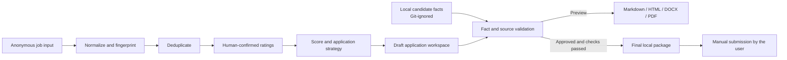

# Local-First Job Application Workflow for Germany

A file-based Python toolkit for organizing a German job search without turning personal application data into a cloud dataset. It converts a `Stellenanzeige` into structured records, supports transparent fit scoring and duplicate detection, creates reviewable application workspaces, and exports validated German or English application documents.

| At a glance | Current implementation |
| --- | --- |
| Problem | Job research, candidate facts, application drafts, and status tracking are often scattered and difficult to verify. |
| Core capabilities | Job normalization, configurable scoring, deduplication, fact gates, application tracking, reports, and Markdown/HTML/DOCX/PDF export. |
| Technology | Python, standard-library CLI modules, JSON/CSV/Markdown, HTML/CSS, OOXML, optional ReportLab and pypdf. |
| Status | Functional local MVP with 14 CLI scripts and 40 automated unit tests; human review and final submission remain mandatory. |

## Overview

The project models a German-market application as a traceable local workflow rather than a collection of unrelated documents. Candidate facts, job requirements, scoring decisions, document drafts, approval status, and export checks are kept in separate files with explicit state transitions.

The design prioritizes three concerns:

- **Traceability:** application claims must map to verified candidate sources.
- **Reproducibility:** scoring, deduplication, reports, and exports use repeatable CLI entry points.
- **Privacy:** real CVs, `Arbeitszeugnisse`, certificates, application records, and credentials remain outside Git.

This repository contains the implementation, documentation, templates, tests, and synthetic examples. It does not contain the candidate's real application data.

## Key Features

### Implemented

- Parse pasted or local job descriptions into normalized JSON records with stable fingerprints.
- Score job fit on ten configurable dimensions, including visible penalties and veto conditions.
- Detect duplicate vacancies using normalized URLs, platform identifiers, company/title/location similarity, and description similarity.
- Create non-overwriting application workspaces with controlled status transitions.
- Block unsupported or conflicting claims through fact records, source traceability, and final-export validation.
- Generate local rankings, application dashboards, weekly reviews, and UTF-8 BOM CSV exports.
- Export German or English CVs and cover letters to Markdown, HTML, DOCX, and PDF.
- Validate A4 layout metadata, OOXML structure, PDF size/page constraints, embedded fonts, extractable text, draft markers, and checksums.
- Provide guided workflows for job analysis, company research, CV tailoring, cover letters, interview preparation, and application tracking.
- Preserve the human decision boundary: the software does not log in, upload documents, send messages, or submit applications.

## Architecture / Workflow

The core implementation is deliberately file-based. Python modules provide deterministic operations; workflow instructions coordinate the review steps around them.



Typical lifecycle:

1. Import or review candidate evidence locally.
2. Normalize a `Stellenanzeige` and identify duplicates.
3. Add human-confirmed ratings and calculate the match score.
4. Create a review workspace for a selected vacancy.
5. Tailor documents using only source-supported facts.
6. Generate a DRAFT preview and run format/fact validation.
7. Export a final package only after explicit approval.
8. Submit manually and update the local application status.

## Tech Stack

| Area | Technology |
| --- | --- |
| Core | Python 3; primarily `argparse`, `csv`, `dataclasses`, `datetime`, `difflib`, `hashlib`, `json`, `pathlib`, `re`, and `zipfile` |
| Storage | Local JSON, Markdown, CSV, and directory-based records |
| Document generation | HTML/CSS, direct OOXML/DOCX generation, browser/WeasyPrint/ReportLab PDF backends |
| Optional PDF validation | `reportlab` and `pypdf` from `requirements.txt` |
| Configuration | JSON-compatible `.yaml` files and JSON template registries |
| Testing | Python `unittest` with synthetic fixtures |
| Automation layer | Repository-scoped workflow skills with explicit fact, privacy, and approval gates |

There is no application server, database, external API requirement, or frontend framework in the current version.

## Project Structure

```text
.
├── job_system/          # Job parsing, scoring, deduplication, tracking, and reports
├── document_export/     # Markdown parsing, renderers, package builder, and validators
├── scripts/             # 14 repeatable CLI entry points
├── config/              # Scoring weights, targets, and source policies
├── templates/           # German CV and cover-letter HTML/CSS templates
├── tests/               # Unit tests and synthetic application fixtures
├── data/sample/         # Explicitly fictional demonstration data
├── skills/              # Canonical guided workflow definitions
├── .agents/skills/      # Discoverable workflow entry points
├── docs/                # Data model, workflow, export, and operating documentation
├── SECURITY.md          # Credential and application-safety boundaries
└── PRIVACY.md           # Local-data and publication policy
```

Runtime directories such as `candidate/`, `applications/`, `data/jobs/`, `reports/`, `tmp/`, and `backups/` are intentionally excluded from version control.

## Quick Start

The included examples are fictional and marked `SAMPLE_DATA_NOT_REAL`; no real candidate data is required.

```powershell
# Check the local environment without installing or changing tools
python scripts/check_environment.py

# Create any missing local runtime directories without overwriting files
python scripts/init_project.py

# Run the complete test suite
python -m unittest discover -s tests -v
```

Score the included synthetic vacancy without changing it:

```powershell
python scripts/score_job.py data/sample/SAMPLE_JOB.json
```

Generate a DRAFT document demo in the ignored `tmp/` directory:

```powershell
python scripts/export_documents.py `
  --application tests/fixtures/document-export-application `
  --document all `
  --language de `
  --formats md html docx pdf `
  --mode preview `
  --output-dir tmp/portfolio-demo `
  --name-prefix sample
```

HTML and DOCX generation use the Python standard library. For the local ReportLab PDF fallback and PDF text checks, use a project-local virtual environment:

```powershell
python -m venv .venv
.\.venv\Scripts\Activate.ps1
python -m pip install -r requirements.txt
```

## Tests & Validation

Run all tests with:

```powershell
python -m unittest discover -s tests -v
```

Current test status: **40 tests run: 36 passed, 4 skipped** (last verified locally on 2026-09-16). The skipped tests require the optional `reportlab`/`pypdf` PDF-validation environment.

The suite covers:

- scoring boundaries, penalties, and vetoes;
- URL normalization and duplicate detection;
- protected application-state transitions and non-overwriting workspaces;
- fact validation and source requirements;
- synthetic-data isolation and configuration integrity;
- Markdown parsing and German character preservation;
- HTML, DOCX, and PDF generation and validation;
- A4/two-page CV, embedded-font, size, ATS text, and DRAFT/final gates;
- export reports, checksums, and template defaults.

Generated documents also receive format-specific validation. Passing structural checks does not replace final visual and factual review by a person.

## Privacy & Security

The repository follows a local-first, privacy-aware design:

- Real CVs, `Lebensläufe`, `Arbeitszeugnisse`, certificates, references, candidate profiles, and application records are Git-ignored.
- `.env`, credentials, tokens, browser profiles, cookies, caches, backups, and generated documents are excluded from version control.
- Core workflows require no API key.
- The committed examples use reserved domains, zero-value phone numbers, and explicit synthetic-data markers.
- Final exports require allowed application status and pass fact/conflict checks.
- The tool never performs the final application submission.

Before publishing or sharing a fork, inspect both tracked files and Git history; `.gitignore` alone does not remove data that was committed previously. See [`SECURITY.md`](SECURITY.md) and [`PRIVACY.md`](PRIVACY.md).

## Current Limitations

- Job-description extraction is intentionally lightweight; hard requirements and preferences require manual verification.
- Match scoring depends on human-confirmed dimension ratings rather than an automatic ML model.
- The standard-library importer reads TXT, Markdown, JSON, and CSV; PDF/DOCX candidate-source extraction requires separate local document review.
- PDF availability and output can vary with installed local backends.
- The project uses files rather than a database and does not provide a GUI.
- Guided research workflows are not a general-purpose crawler and respect login, permission, and anti-automation boundaries.
- Visual inspection is still required for final DOCX/PDF output.

## Roadmap

Planned work is kept separate from implemented functionality:

- Add privacy and secret scanning to continuous integration.
- Improve structured extraction of job requirements while retaining human confirmation.
- Add optional local PDF/DOCX candidate-source extraction with provenance metadata.
- Expand cross-platform document-rendering verification.
- Add richer anonymized fixtures for company research, interviews, and multi-stage application tracking.
- Evaluate a lightweight local dashboard without weakening the file-based data model or privacy boundary.

## Development Workflow

Development may use AI-assisted implementation and review, but repository behavior is defined by versioned code, explicit workflow rules, synthetic fixtures, and executable tests. Generated suggestions are treated as drafts and are validated before acceptance.
